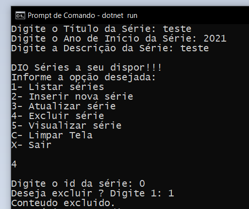

# Criando uma APP simples de cadastro de séries - Prática .NET

Esse é o repositório referente ao projeto "Criando um APP simples de cadastro de séries em .NET" do bootcamp da Localiza em parceria com o programa Órbi Academy Techboost e a Digital Innovation One.

Neste projeto prático foi criado um app de cadastro de séries em memória usando C# e .NET.

Em relação ao projeto original eu adicionei uma mudança no método que permite a exclusão de uma série já cadastrada anteriormente. 

Antes da série ser excluida surge uma pergunta de confirmação e o usuário deve aceitar para então a série ser deletada.

Exemplo da funcionalidde adicionada:

